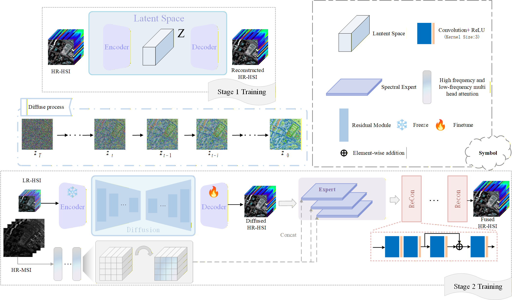

# Dif-MoSE

=======
# Abstract
Hyperspectral images (HSI) are spectrally rich but spatially low-resolution, while multispectral images (MSI) offer high spatial resolution. Fusing the two to generate high-resolution HSI is therefore a promising direction. Existing methods face two core challenges: 1) raw data domain diffusion models lack high-resolution latent priors, hindering spectral-spatial coupling modeling and limiting fusion accuracy; 2) they overlook HSI band differences and ignore spectral interval correlations, leading to cross-interval spectral conflicts and compromised spectral fidelity.

To address these, this paper proposes a two-stage framework integrating Variational Autoencoder (VAE) and diffusion models. A VAE is pre-trained to learn high-resolution HSI latent representations for prior constraint, and diffusion models in the latent space optimize low-resolution HSI, deeply coupling prior information with generated features. Meanwhile, High-Frequency Detail Multi-Head Attention (HFDMA) and Low-Frequency Structure Multi-Head Attention (LFSMA) are designed: HFDMA captures MSI’s high-frequency details via local window self-attention, while LFSMA extracts low-frequency structure through window average pooling, enhancing spatial feature extraction.

Additionally, HSI is divided into three spectral sub-intervals by cosine similarity, and Mixture of Spectral Experts (MoSE) assigns dedicated networks to each interval to alleviate cross-interval conflicts. Experiments on Pavia University, Pavia Center, and Chikusei datasets show the method outperforms state-of-the-art approaches in PSNR, SAM, SSIM, RMSE, and ERGAS, significantly improving fused images’ spatial details and spectral fidelity.
